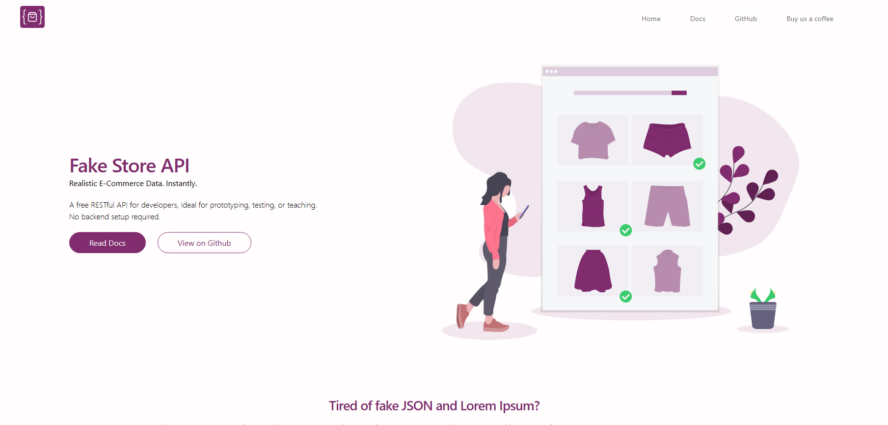
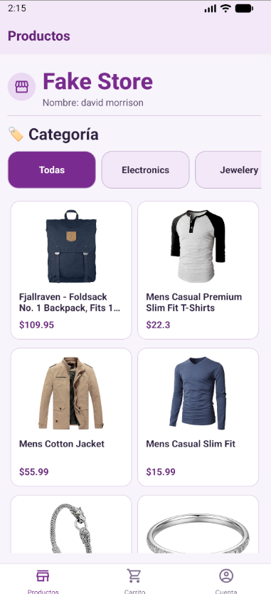
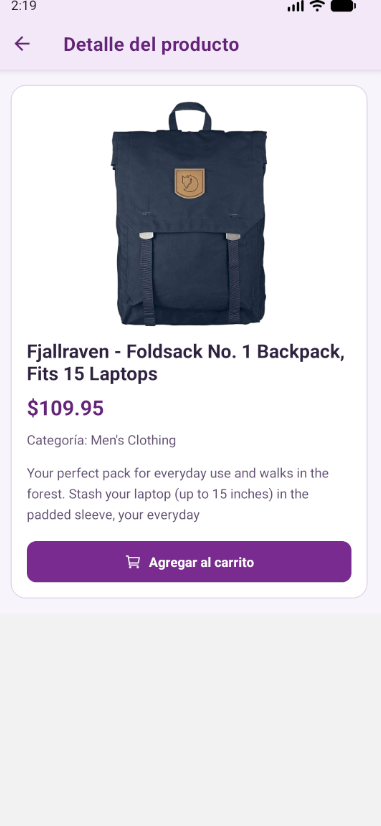
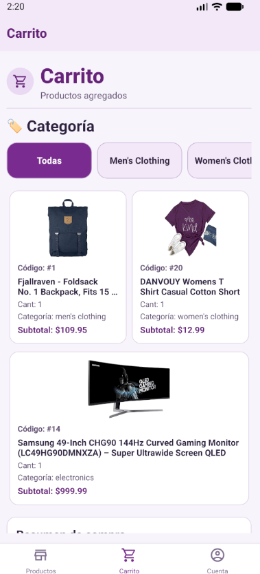
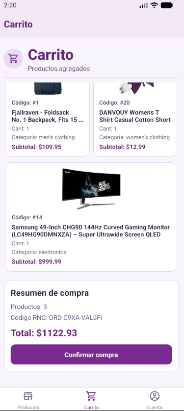
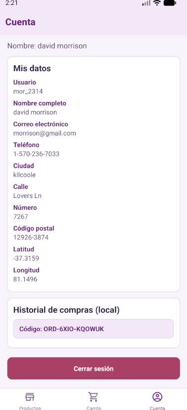

# Test01Apps2_2026

Aplicación móvil en **React Native + Expo** que consume la API de **Fake Store** .
Permite iniciar sesión, navegar productos, ver detalle, agregar al carrito, confirmar compra y consultar historial local.

## Características

- Autenticación (login y registro)
- Listado de productos por categorías
- Detalle de producto con opción de agregar/quitar del carrito
- Carrito con total y confirmación de compra
- Historial de compras guardado localmente (`AsyncStorage`)
- Vista de cuenta con datos del usuario y acceso al historial

## Tecnologías

- Expo
- React Native
- React Navigation (stack + tabs)
- AsyncStorage
- Axios

## Requisitos

- Node.js 18+
- npm 9+
- Expo CLI (opcional, también se puede usar con `npx`)

## Instalación

```bash
npm install
```

## Ejecución

```bash
npm run start
```

Atajos disponibles:

```bash
npm run android
npm run ios
npm run web
```

## Usuario de prueba

Credenciales de ejemplo de Fake Store API:

- **Usuario:** `mor_2314`
- **Contraseña:** `83r5^_`

## Estructura principal

```text
src/
  components/
  config/
  styles/
  views/
```

## Capturas de pantalla

> Las imágenes están en la carpeta `imgReadme/`.

### Landing / Referencia visual



### Flujo principal

| Productos                             | Detalle de producto                                 |
| ------------------------------------- | --------------------------------------------------- |
|  |  |

| Carrito                           | Carrito con compra                              |
| --------------------------------- | ----------------------------------------------- |
|  |  |

| Cuenta                          | Historial de compra                                 |
| ------------------------------- | --------------------------------------------------- |
|  |  |

## Notas

- El historial de compras se almacena localmente en el dispositivo.
- El proyecto usa la API pública de Fake Store para datos y autenticación de prueba.
- Documentación oficial de la API: https://fakestoreapi.com/
